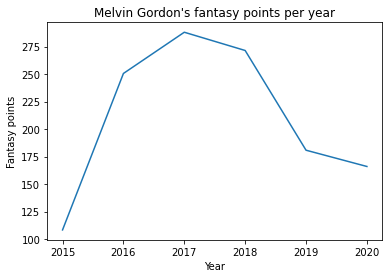
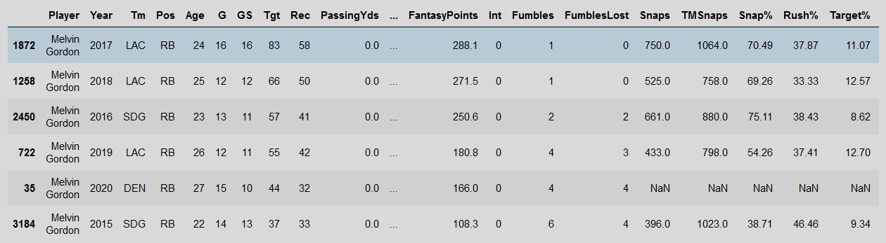
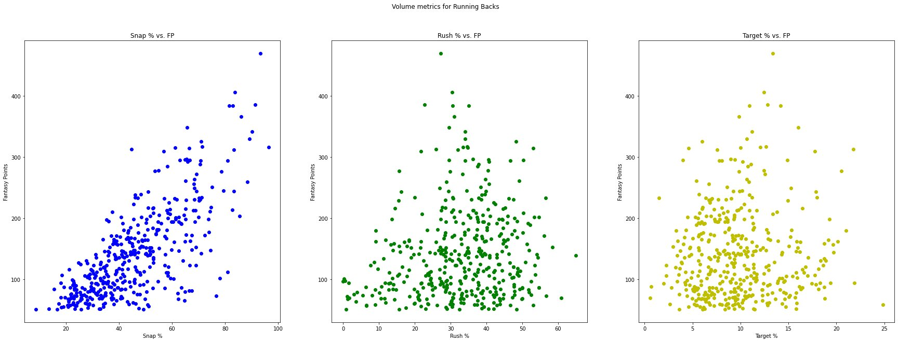
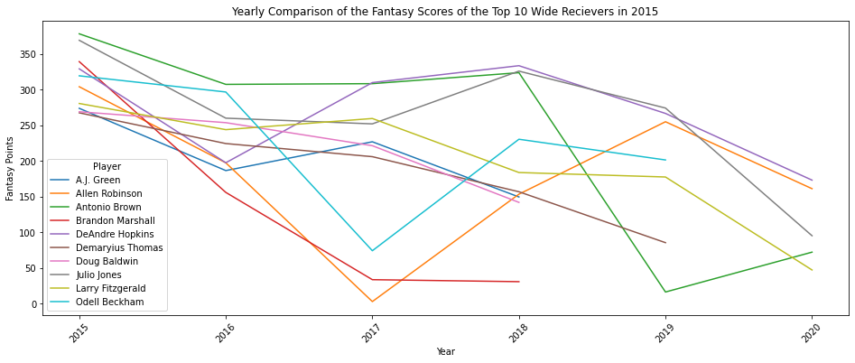
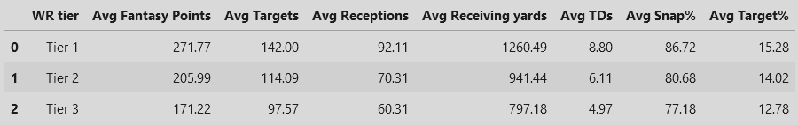

# Yearly Fantasy Football Analysis

Conor Bradley

Kaathihan Luxmachandran

Pratham Patel

Tristan Ro

## Introduction

The topic of this research assignment is the analysis of yearly Fantasy Football. Fantasy Football is a $22 billion industry, which amasses over 40 million users per year.  This market is tremendous in size and the NFL is collecting more advanced statistics, which can give users an advantage to figure out which players will succeed. Before we describe our dataset, we must introduce what Fantasy Football is to uninformed readers. Fantasy Football is an online league which gets created prior to the start of the actual NFL season, this league allows users to create and control a team, made up of real NFL players based on their fantasy production. The order in which users can choose players are from the unique draft pick allowance the league gives. Once a user drafts a player, that player is now inaccessible by other users. In addition, to the statistics of the players in the NFL season, users are provided with fantasy points, in turn keeping the competitiveness of this league fairly high.

The dataset being analyzed is the _Fantasy Football Data Sets_, created by FantasyPros.  This company is the top statistics compiler for fantasy sports, specializing in fantasy football.  This dataset was formed by compiling snap count data as well as yearly data of the players in the NFL. The data spans all the way back from the 1970&#39;s until 2019, solidifying the reputation of FantasyPros. The information collected was from games in the real seasons as well as the fantasy league, to help decipher the overall score of the player. We used the years 2015 - 2019 for this analysis. This dataset can be accessed through the GitHub link provided: https://github.com/fantasydatapros/data .

## Discussion

When investigating players&#39; statistics, we were able to explore many different interesting subjects that could benefit a user&#39;s experience and success with their fantasy football team, which is the ultimate goal of the analysis. Some areas of analysis include the volume for players, which is the number of opportunities garnered by a player in a game. We also explore the volatility and importance of different positions from a year-to-year basis. Finally, we observed the effect of a &quot;heavy&quot; workload on running backs and whether this led to injury.

To get a better idea of what we looked at for analyzing the statistics of players, below we have the statistics of the player Melvin Gordon.

This figure shows a quick distribution of Melvin Gordons fantasy points over the years 2015 – 2020.

This DataFrame of 6 rows and 27 columns show Melvin Gordons stats with each row being the next year from 2015 – 2016.

In the fantasy football word, volume reigns supreme. It is a simple concept where the more touches/targets a player gets the more likely they are to produce results. But the variables that are most responsible for volume is the question we sought to answer. Running Backs, Wide Receivers and Tight Ends were each analyzed separately.

When we finished analyzing the snap, rush and target percentage in correlation with their relationship to fantasy points, we found that snap percentage had a positive correlation with fantasy points in every position, but interestingly, rushing percentage had little to no correlation.

   The position of Running Backs is a good way to represent the difference between the measurements of each of the columns that were analyzed with fantasy points.

Next, we observed the volatility of the NFL&#39;s top-tier Wide Receivers to determine how valuable they are to a fantasy football team. We took the top 10 Wide Receivers of every year and followed their performance to see their change in point accumulation every year.

Our results allowed us to observe the fluctuations and predictability of the top receivers, which allows people to decide if they want to draft them or not.

For example, this plot represents the top 10 fantasy wide receivers from 2015 and displays their yearly points in the later years.   

As seen above, one can assess the steady decline in fantasy points and the players involved and can attribute these spikes and falls to things such as players aging or even lack of consistency in having good / bad years.

Quarterbacks are of course a key position in every team, especially for fantasy football.  The question we set out to find the answer to is how large a difference does good quarterbacks make compared to an average one in a fantasy football team. Thus, we compared the top quarterbacks with the mid ranked quarterbacks and analysed our findings. We discovered that the top quarterbacks fluctuate a lot less than the mid-tier quarterbacks. It is important to note that when analyzing the consistency of Quarterbacks, they are quite consistent on a yearly basis. After observing, there was no noticeable drop in performance like the wide receivers had and we can further speculate that Quarterbacks are less likely to be injured being in their technical position. This may indicate that quarterbacks are more likely to have a peak in performance longer than wide receivers do and thus should be taken into account when choosing a Quarterback for a fantasy team.

After analyzing the consistency of wide receivers, we wanted to find the difference between each tier of receiver (each tier contains 14 WRs).

   The most surprising result was just how wide the gap between tier 1 and tier 2. It was much larger than the difference between 2 and 3, indicating how important a high-level Wide Receiver is on a fantasy team. All tiers shared a target share of over 11% which was unexpected. Thus when putting together a team we would strongly suggest choosing Wide Receivers with a target share greater than 11%.

We have spoken about positions and injuries, but no other position is affected more from injuries than the Running Back. This relationship plays a big factor in determining their value in a fantasy team. We wanted to analyze any correlations that may be involved with a Running Backs number of injuries.

We decided to measure a heavy workload as a Running Back with over 170 carries and a player being injured would be labeled if they missed at least 3 games. From this we were able to find that 43% of players with a heavy workload got injured which is close to half. Though this didn&#39;t give us an overwhelming majority, it opened our team and our analysis up to more questions and theories, such as what could be causing the players with such higher workloads avoid getting injured? Were there any other factors in play with the other 57% who were not getting injured.

## Conclusion

Working through this project gave us insights we did not have before and also revealed the errors and limitations we would run into as well. Exploring the volume of players in the data allowed us to find that it was the players snap percentage which had a positive correlation with their fantasy points for all the positions analysed.

When analysing specifically the Wide Receivers we found that a lot could be taken from our data such as the top players consistency over the years and how often they were either getting injured or suspended and thus not accumulating any points.

This information later allowed us to compare it to the quarterbacks we analyzed and showed they were much more likely to be consistent with their point accumulation over many years, likely being due to the fact they are less likely to get injured which further confirms our assumption that when running backs points were falling to 0, it was an indication of an injury. So unexpectedly, our analysis on quarterbacks helped us solve an unanswered question from a previous analysis.

We also found a significant gap in performance between the top tier Wide Receivers and the rest of the tier players. What was unexpected was the size of the gap that was larger than expected. What was also unexpected was that we found that all wide receivers had a target rate of over 11%.

Finally, we looked at the Running Backs and explored the correlation between our own defined workload, estimated at a higher-than-average carry, and the number of injuries which came with this. A limitation we ran into was finding a way to determine what defined a heavy workload when analyzing the Running Backs in the data.

As we continued our analysis we found many routes, paths and alternatives where we could continue to gain more interesting discoveries from the data that help with formulating strategies in fantasy football. There were also learning opportunities that made us think about how we would do certain things differently to improve the analysis. Much potential exists for further data science applications from this analysis. From simple projections about players, following players trends and being able to rank their potential from the data gathered over past seasons. As stated before, further analyzing the cause of injuries and what factors exist that lead to injuries becoming less likely, or even being able to calculate the likelihood of an injury for a certain player. Again, there is much potential for data science applications from the information gathered from our research and inspection of fantasy football player analysis. There is plenty of potential for implementing additional projections and trends to help formulate strategies for those creating or looking to improve their fantasy football team.

## Acknowledgement

This project was submitted as the final course project for CSCI 2000U &quot;Scientific Data Analysis&quot; during Fall 2021. The authors certify that the work in this repository is original and that all appropriate resources are rightfully cited.

## README

This project is a Jupyter Notebook where users can analyze data from the _Fantasy Football Data Sets_ dataset provided by FantasyPros. The implementation is simple in order to keep the scope of the project in check. We wanted to make this project to expand our knowledge of statistics of NFL players in fantasy football through the usage of Python. Many data analysis techniques were used such as cleaning, merging, analyzing, splitting, condensing, etc.

Technologies used:

• Python

• Pandas

• NumPy

• MatPlotLib
